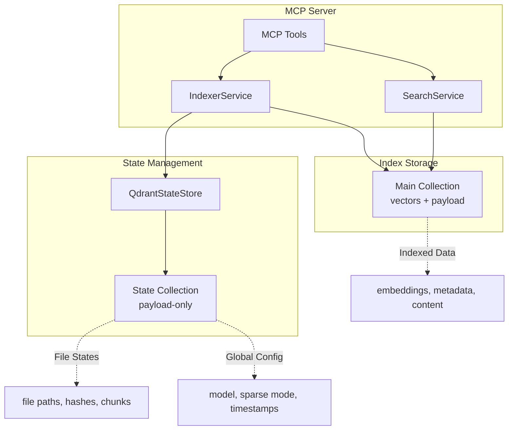

# Agentic RAG MCP Server

A powerful Model Context Protocol (MCP) server that provides **agentic retrieval-augmented generation (RAG)** capabilities for your codebase. This server enables AI assistants to intelligently search, analyze, and retrieve relevant code context using advanced hybrid search and multi-hop reasoning.

## 🌟 Key Features

### Intelligent Search
- **Hybrid Search**: Combines semantic (dense vectors) and keyword (BM25/FastEmbed sparse) search for optimal retrieval
- **Agentic Multi-Hop Search**: Iterative query planning and evidence synthesis for complex questions
- **Cross-Encoder Reranking**: Improves result relevance with state-of-the-art reranking models

### Stateless Architecture
- **Qdrant-Based State Management**: All index state stored in Qdrant collections (no local files)
- **Distributed-Ready**: Multiple instances can share the same index state
- **Scalable**: No JSON file size limitations, handles large codebases efficiently

### Flexible Configuration
- **Multiple Embedding Providers**: OpenAI, local models (via Ollama), Hugging Face
- **Customizable Chunking**: Adaptive chunking strategies for different file types
- **Incremental Indexing**: Only re-index changed files based on content hashing

## 🏗️ Architecture



## 📦 Installation

This MCP server is designed to be installed as an **external MCP server** via `uvx`. No manual cloning required.

### Quick Start

Add to your MCP client configuration (e.g., Claude Desktop's `claude_desktop_config.json`):

```json
{
  "mcpServers": {
    "agentic-rag": {
      "type": "stdio",
      "command": "uvx",
      "args": [
        "--from",
        "git+https://github.com/your-org/agentic-rag-mcp.git",
        "agentic-rag-mcp"
      ],
      "env": {
        "QDRANT_URL": "https://your-cluster.cloud.qdrant.io",
        "QDRANT_API_KEY": "your-qdrant-api-key",
        "QDRANT_COLLECTION": "your-collection-name",
        "OPENAI_API_KEY": "sk-..."
      }
    }
  }
}
```

> **Note**: Replace `your-org` with the actual GitHub organization/username where this repo is published.

## 🔧 Configuration

All configuration is done via **environment variables** in your MCP client configuration. Each component can use different providers.

### Required Environment Variables

| Variable | Description |
|----------|-------------|
| `CODEBASE_ROOT` | Absolute path to your codebase root directory (required for indexing) |
| `QDRANT_URL` | Qdrant Cloud or self-hosted URL |
| `QDRANT_API_KEY` | Qdrant API key |
| `QDRANT_COLLECTION` | Collection name for your codebase |

Plus at least one provider API key (see examples below).

### Provider Options

All providers use OpenAI-compatible API format:

- **openai**: `OPENAI_API_KEY`
- **openrouter**: `OPENROUTER_API_KEY`
- **gemini**: `GEMINI_API_KEY`
- **local** (Ollama/vLLM/LM Studio): `LOCAL_LLM_URL`, `LOCAL_LLM_API_KEY` (optional)

### Component Configuration

Each component can independently use any provider:

| Component | Provider Env | Model Env | Default Model |
|-----------|--------------|-----------|---------------|
| Embedding | `EMBEDDING_PROVIDER` | `EMBEDDING_MODEL` | `text-embedding-3-small` |
| Planner | `PLANNER_PROVIDER` | `PLANNER_MODEL` | `gpt-4o-mini` |
| Synthesizer | `SYNTHESIZER_PROVIDER` | `SYNTHESIZER_MODEL` | `gpt-4o-mini` |
| Judge | `JUDGE_PROVIDER` | `JUDGE_MODEL` | `gpt-4o-mini` |

### Configuration Examples

#### Example 1: All OpenAI (Recommended for best quality)
```json
"env": {
  "QDRANT_URL": "https://xxx.cloud.qdrant.io",
  "QDRANT_API_KEY": "your-key",
  "QDRANT_COLLECTION": "my-codebase",
  "OPENAI_API_KEY": "sk-...",
  "EMBEDDING_PROVIDER": "openai",
  "EMBEDDING_MODEL": "text-embedding-3-small"
}
```

#### Example 2: All Local with Ollama (Privacy-focused, free)
```json
"env": {
  "QDRANT_URL": "https://xxx.cloud.qdrant.io",
  "QDRANT_API_KEY": "your-key",
  "QDRANT_COLLECTION": "my-codebase",
  "LOCAL_LLM_URL": "http://127.0.0.1:11434/v1",
  "EMBEDDING_PROVIDER": "local",
  "EMBEDDING_MODEL": "qwen3-embedding:4b",
  "EMBEDDING_MAX_TOKENS": "32768",
  "PLANNER_PROVIDER": "local",
  "PLANNER_MODEL": "qwen3:4b",
  "SYNTHESIZER_PROVIDER": "local",
  "SYNTHESIZER_MODEL": "qwen3:4b",
  "JUDGE_PROVIDER": "local",
  "JUDGE_MODEL": "qwen3:4b"
}
```

#### Example 3: Mixed Providers (OpenRouter embedding + Local LLMs)
```json
"env": {
  "QDRANT_URL": "https://xxx.cloud.qdrant.io",
  "QDRANT_API_KEY": "your-key",
  "QDRANT_COLLECTION": "my-codebase",
  "OPENROUTER_API_KEY": "sk-or-v1-...",
  "LOCAL_LLM_URL": "http://127.0.0.1:11434/v1",
  "EMBEDDING_PROVIDER": "openrouter",
  "EMBEDDING_MODEL": "qwen/qwen3-embedding-8b",
  "PLANNER_PROVIDER": "local",
  "PLANNER_MODEL": "qwen3:4b",
  "SYNTHESIZER_PROVIDER": "local",
  "SYNTHESIZER_MODEL": "qwen3:4b",
  "JUDGE_PROVIDER": "local",
  "JUDGE_MODEL": "qwen3:4b"
}
```

## 🚀 Usage

### Available MCP Tools

#### 1. `index-files`
Index specific files into Qdrant:
```python
# The AI can call:
index-files(
    file_paths=["src/main.py", "src/utils.py"],
    metadata={"category": "core"}
)
```

####2. `index-by-pattern`
Batch index files matching a glob pattern:
```python
# Examples:
index-by-pattern(pattern="src/**/*.py")
index-by-pattern(pattern="docs/**/*.md", force=True)
```

#### 3. `agentic-search`
Multi-hop intelligent search with reasoning:
```python
agentic-search(
    query="How does the authentication flow work?",
    max_iterations=5
)
```

#### 4. `quick-search`
Fast single-pass search:
```python
quick-search(
    query="find UserService class",
    operator="hybrid",  # hybrid, semantic, keyword, exact
    top_k=10
)
```

#### 5. `index-status`
Check current index status:
```python
index-status()
# Returns: indexed_files, points_count, embedding_model, last_index_time
```

### State Management

All index state is stored in Qdrant in a dedicated state collection (`{collection-name}-state`):

- **File States**: Path, content hash, chunk count, index timestamp
- **Global Config**: Embedding model, sparse mode, last index time
- **No Local Files**: No `.agentic-rag-index-state.json` required

This enables:
- ✅ Distributed indexing across multiple instances
- ✅ Automatic state synchronization
- ✅ No file system dependencies
- ✅ Scalable to millions of files

### Sparse Encoding Modes

Control keyword search behavior:

- `bm25` (default): Traditional BM25 algorithm
- `fastembed`: FastEmbed sparse embeddings
- `none`: Disable sparse search (semantic only)

Set via environment variable:
```json
"SPARSE_MODE": "bm25"
```

### Chunking Strategy

Files are chunked adaptively based on file type:
- **Code files**: AST-aware chunking preserving function/class boundaries
- **Markdown**: Section-based chunking
- **Plain text**: Sliding window with overlap

Default: 500 tokens per chunk, 50 token overlap

## 🧪 Development & Testing

### For Contributors

If you want to develop locally:

```bash
git clone https://github.com/your-org/agentic-rag-mcp.git
cd agentic-rag-mcp
python -m venv venv
source venv/bin/activate  # On Windows: venv\Scripts\activate
pip install -e ".[dev]"
```

### Run Tests

```bash
# Syntax check
python check_syntax.py

# Functional tests (uses test collection)
python test_qdrant_state.py

# Unit tests
pytest
```

## 📊 Monitoring

### Check Index Status

Use the `index-status` tool:
```python
index-status()
```

Returns:
```json
{
  "indexed_files": 1247,
  "points_count": 5438,
  "embedding_model": "text-embedding-3-small",
  "sparse_mode": "bm25",
  "last_index_time": "2026-02-08T09:20:52.241095"
}
```

### Qdrant Dashboard

- **Cloud**: https://cloud.qdrant.io
- **Local**: http://localhost:6333/dashboard

## 🛠️ Troubleshooting

### Connection Issues

**Problem**: Cannot connect to Qdrant
```
Error: Connection refused
```

**Solution**: Verify Qdrant URL and API key:
```bash
# Test connection
curl -H "api-key: $QDRANT_API_KEY" "$QDRANT_URL/collections"
```

### State Collection Not Found

**Problem**: State collection doesn't exist
```
Collection 'xxx-state' not found
```

**Solution**: State collection is auto-created on first use. Run `index-files` once:
```python
index-files(file_paths=["README.md"])
```

### Indexing Hangs

**Problem**: Indexing takes too long or hangs

**Possible causes**:
- Large files (>1MB): Chunking may be slow
- Network issues: Check Qdrant connection
- Embedding API rate limits: Reduce batch size

**Solution**:
```json
"EMBEDDING_BATCH_SIZE": "4"
```

### Memory Issues

**Problem**: Out of memory errors

**Solution**: Qdrant's on-disk payload is enabled by default. For very large codebases, consider using a larger Qdrant instance.

## 🔄 Migration from Local State

If you previously used a version with local `index_state.json`:

1. **The state is now in Qdrant**: All file states and config are stored in `{collection}-state` collection
2. **Old JSON files are ignored**: The server no longer reads `.agentic-rag-index-state.json`
3. **Re-indexing**: Simply run `index-by-pattern` again - it will detect unchanged files and skip them

## 🤝 Contributing

Contributions welcome! Areas for improvement:

- [ ] Additional embedding provider support
- [ ] Performance benchmarks
- [ ] Web UI for index management
- [ ] Advanced chunking strategies

## 📝 License

MIT

## 🙏 Acknowledgments

Built with:
- [MCP](https://github.com/anthropics/mcp) - Model Context Protocol
- [Qdrant](https://qdrant.tech) - Vector database
- [Sentence Transformers](https://www.sbert.net) - Embedding models
- [FastEmbed](https://github.com/qdrant/fastembed) - Lightweight embeddings

---

**Questions?** Open an issue on GitHub.